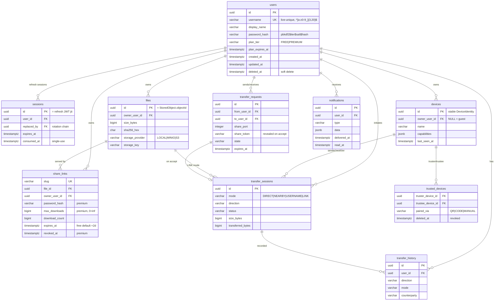

# Air — Unified Platform, Part 2

**Storage · Database · API · Security · Plans · Performance · Production delivery**

Delivery record for Part 2, building directly on [UNIFIED-PLATFORM.md](UNIFIED-PLATFORM.md) (Part 1). Every class, file, and endpoint named here exists in this repository and is covered by the build. Nothing here introduced a second service, engine, or API — Part 2 hardened the one backend.

**Artifacts delivered:**

| Deliverable | Where |
|---|---|
| PostgreSQL schema (10 tables, full SQL) | [db/migrations/V1__unified_schema.sql](../db/migrations/V1__unified_schema.sql) |
| ER diagram | §2 below |
| StorageProvider + Local/MinIO/S3 | `p2p.storage.*` |
| OpenAPI 3.1 / Swagger spec | [docs/openapi.yaml](openapi.yaml) |
| Security architecture | §4 below + `p2p.security.*`, `p2p.auth.*` |
| Free/Premium enforcement (service layer) | `p2p.plan.*` + `LinkShareService` |
| Docker setup | [Dockerfile.backend](../Dockerfile.backend), [docker-compose.yml](../docker-compose.yml) |
| CI/CD pipeline | [.github/workflows/ci.yml](../.github/workflows/ci.yml) |
| Monitoring & observability | §7 + `p2p.observability.Metrics`, [deploy/prometheus.yml](../deploy/prometheus.yml) |
| Deployment architecture | §8 below |
| Testing strategy | §9 below + `src/test/java/p2p/**` |
| Production code skeletons (storage/API/security) | `p2p.storage`, `p2p.api`, `p2p.security`, `p2p.user.PgUserRepository` |

---

## 1. Storage system

```
                 LinkShareService (the only writer)
                          │
                          ▼
              ┌─────────────────────────┐
              │  StorageProvider (port) │  put / stat / open(offset) /
              │                         │  openChannel / localPath /
              └───────────┬─────────────┘  delete / list
        ┌─────────────────┼──────────────────────┐
        ▼                 ▼                      ▼
 LocalStorageProvider  MinioStorageProvider  S3StorageProvider
 (dataDir/storage,     └──────────┬──────────────┘
  sidecar .meta,                  ▼
  zero-copy channel)   S3CompatibleStorageProvider
                       (ONE implementation: AWS SDK v2,
                        spool→hash→put, ranged GET,
                        metadata in object user-metadata)
```

Design decisions:
- **MinIO and S3 share one implementation** (`S3CompatibleStorageProvider`); the subclasses differ only in client construction (endpoint override + path-style for MinIO). This is the "no duplicate logic" rule applied to infrastructure.
- **Provider independence at the read path**: `TransferEngine.streamStored()` asks the provider for a `FileChannel` (local → kernel zero-copy `transferTo`) and falls back to a ranged `GET` stream (remote). API handlers never know which provider is live.
- **Migration between providers** = copy objects (ids are the object keys), flip `FYLO_STORAGE`. The `files` table records `storage_provider` + `storage_key` per object so mixed states during migration are representable.
- **Selection** is one env var read in one place: `StorageProviders.fromEnv()`.

## 2. Database — ER diagram

Full DDL with indexes, constraints, soft deletes, audit fields, and an `updated_at` trigger on every table: [db/migrations/V1__unified_schema.sql](../db/migrations/V1__unified_schema.sql). CI applies it to a blank PostgreSQL 16 on every push (`schema-check` job).



Repository integration: `UserRepository` now has two implementations — `JsonUserRepository` (single node, zero infra) and `PgUserRepository` (selected automatically when `DATABASE_URL` is set). The remaining JSON stores (`links.json`, `subscriptions.json`, history) map 1:1 onto `share_links`, `users.plan_*`, `transfer_history` and migrate behind the same service interfaces.

## 3. API

The complete REST surface is specified in [openapi.yaml](openapi.yaml) (OpenAPI 3.1; loads directly in Swagger UI/Redoc — it *is* the Swagger file). It documents every module — Authentication, Users, Devices, Discovery, Transfers, Uploads, Downloads, Share Links, Transfer Requests, Notifications, History, Plans, Observability — with request models, response models, and the two error models (`Error`, `PlanLimitError` with machine-readable `limit` codes). Everything in the spec is implemented and smoke-tested against the running jar.

## 4. Security architecture

Layered, from the wire up:

| Layer | Mechanism | Where |
|---|---|---|
| **TLS** | Terminated at the edge (nginx/Traefik/ALB); backend listens on plain HTTP inside the private network. `nginx.conf.example` carries the proxy config; HSTS + TLS1.2+ at the edge. Direct P2P sockets on a LAN are consent-based; WAN direct transfers ride the HTTPS gateway. | deploy layer |
| **JWT** | HS256, 32-byte persisted secret; `typ` claim separates ACCESS (15 min) / REFRESH (30 d) / DEVICE tokens; constant-time signature compare. Multi-node: same secret via secret manager (or move to RS256 with a JWKS endpoint — one class to change). | `JwtService` |
| **Replay protection** | Refresh tokens are **single-use** (jti registry). A replayed refresh token revokes the entire session family (`SessionService.consume` → `revokeAllFor`). Verified in the live smoke test. | `SessionService`, `AuthService.refresh` |
| **Transfer tokens** | 128-bit random per-share bearer tokens, constant-time compare, auth **before** any metadata is revealed; username-share tokens stay server-side until the receiver explicitly accepts. | `TransferTokens`, `FileSender`, `UsernameShareService` |
| **Trusted devices** | Trust is granted only by QR/code pairing with a one-time, 2-minute secret (consumed atomically) or explicit user action; trust policy is centralized in `TrustedDeviceService`. | `QrPairingService`, `TrustedDeviceService` |
| **Rate limiting** | Token buckets per client IP × policy class: AUTH 10/min, API 120/min, DOWNLOAD 60/min, UPLOAD 20/min; 429 + Retry-After. Applied in the API router *and* the gateway upload/download handlers. Strict global limits at the edge (`limit_req`) for multi-node. | `RateLimiter`, `ApiRouter`, `FileController` |
| **Path traversal** | All filenames pass `FileReceiver.sanitizeFilename` on both directions; storage object ids are server-generated UUIDs (never user input) and re-validated (`requireOpaqueId`); range/checksum requests are bounds-checked in the protocol. | transfer + storage layers |
| **Checksum validation** | SHA-256 whole-file manifest verification on receive; CRC32C per-chunk repair re-fetches corrupted chunks; storage writes hash in the same pass and record the digest (`files.sha256_hex`, `X-Content-SHA256`). | engine + storage |
| **Malicious file protection** | Public links refuse executable/script payloads (last-extension check catches `invoice.pdf.exe`), Windows reserved names, control characters; env-togglable. Content scanning (ClamAV sidecar) plugs in behind the same `Verdict` API. Live P2P modes are consent-based and unfiltered by design. | `FileSafetyService` |
| **Password-protected links** | PBKDF2-hashed link passwords, constant-time verify, accepted via header or query. | `LinkShareService.passwordMatches` |

Secrets hygiene: JWT secret and (in compose) DB/MinIO credentials are injected via env; nothing secret is in the image. Passwords are handled as `char[]` up to the hash boundary.

## 5. Plans — Free vs Premium

Enforcement is **service-layer only** (`p2p.plan` + `LinkShareService.enforceCreate`); the API layer merely translates `PlanLimitException` → `403 {code:"plan_limit", limit:"…"}`. Unit-tested in `PlanEnforcementTest`.

| Entitlement | FREE | PREMIUM |
|---|---|---|
| Direct Share / Nearby Share | **Unlimited** (never touch storage or plans) | Unlimited |
| Username Share | Basic (3 concurrent, 100-entry history) | Priority (10 concurrent, unlimited history) |
| Link expiry | 2 days (fixed) | 7/30/90 days, custom, **never** |
| Max file size (links) | 10 GB | 200 GB |
| Storage | 10 GB | 500 GB / 1 TB / 2 TB (subscription tier) |
| Active links | 10 | 1 000 |
| Password links / download limits / analytics / revocation | — | ✔ |
| Trusted devices | 5 | Unlimited |
| Ecosystem sync (clipboard/photo/folder) | — | ✔ (gates Part 3 features) |

`PlanService` is the one authority (`entitlementsFor(userId)`); subscriptions persist to `subscriptions.json` now and to `users.plan_tier/plan_expires_at` + billing webhooks in production — same API, no caller changes.

## 6. Performance targets & benchmark strategy

**Model:** one virtual thread per connection/transfer over NIO channels; no file bytes on the heap (send = `transferTo`/sendfile, receive = fixed direct buffers, storage = spool-and-hash single pass). Memory per idle connection ≈ 1 KB stack + < 1 MB frame buffers per active protocol connection ⇒ **thousands of concurrent transfers fit in a few hundred MB of heap**; a 40 GB transfer stays < 100 MB RSS (Part 1 verified design; see ARCHITECTURE.md for the memory budget).

**Benchmark strategy** (repeatable, CI-runnable subsets):
1. **Micro**: `TransferIntegrationTest` already measures the engine loop; add JMH for frame encode/decode if the protocol evolves.
2. **Single-transfer throughput**: 1/5/10/40 GB files over loopback and a real 1 GbE/10 GbE LAN; record MB/s, RSS (`jcmd VM.native_memory`), CPU. Target: NIC-limited on LAN (≥ 900 Mb/s on 1 GbE), < 100 MB RSS.
3. **Concurrency ladder**: 10 → 100 → 1 000 → 5 000 simultaneous downloads of one share (the sender is the hot spot: accept loop + N virtual threads). Track p50/p99 time-to-first-byte, error rate, heap.
4. **API load**: `wrk`/`k6` against auth + link endpoints (JSON paths): target ≥ 5 000 req/s single node with p99 < 50 ms (they are in-memory hash-map operations).
5. **Soak**: 24 h mixed workload with the expiry sweeper active; assert zero descriptor/heap growth (watch `fylo_jvm_heap_used_bytes`).

## 7. Observability

- **Metrics** (implemented): `/metrics` in Prometheus text format — `fylo_http_requests_total{route,status}`, `fylo_link_upload_bytes_total`, `fylo_link_download_bytes_total`, `fylo_transfers_active`, `fylo_transfers_queued`, JVM heap/CPU gauges. Counters are `LongAdder`s; gauges sample at scrape time — zero hot-path cost.
- **Prometheus + Grafana** ship in compose ([deploy/prometheus.yml](../deploy/prometheus.yml), auto-provisioned datasource). Dashboards to build first: request rate/error rate/duration by route; active vs queued transfers; bytes in/out; heap vs RSS; 429 rate (abuse signal).
- **Alerts** (Prometheus rules, next step): error ratio > 2% 5 min; `fylo_transfers_queued` sustained growth (queue starvation); heap > 85%; scrape absence (instance down).
- **Tracing** (design): adopt OpenTelemetry Java agent (zero code change) exporting OTLP → Tempo/Jaeger; propagate `traceparent` from the UI. Spans of interest: API dispatch → engine offer/receive → storage put/get. Custom span attributes: transferId, mode, bytes.
- **Logs**: current stdout logging is docker-native (`docker logs`, Loki-scrapable). Structured JSON logging is a contained change (single `Log` helper) when aggregation arrives.

## 8. Deployment architecture — horizontal scaling

```
                    Internet
                       │
              ┌────────▼────────┐
              │  Edge LB / CDN  │  TLS, HSTS, limit_req, WAF
              │ (nginx/Traefik/ │  /s/* cacheable via presigned URLs later
              │      ALB)       │
              └───┬────────┬────┘
          least-conn│      │sticky NOT required (stateless JWT)
        ┌─────────▼─┐    ┌─▼─────────┐
        │ fylo-node1 │    │ fylo-node2 │   … N replicas, same image
        └─┬────┬────┬┘    └┬────┬────┬─┘
          │    │    │      │    │    │
          ▼    ▼    ▼      ▼    ▼    ▼
   ┌──────────┐ ┌─────────────┐ ┌──────────────┐
   │PostgreSQL│ │ MinIO / S3  │ │ Redis (P3):  │
   │ primary  │ │ (shared     │ │ presence,    │
   │ +replica │ │  objects)   │ │ notif pub/sub│
   └──────────┘ └─────────────┘ └──────────────┘
```

What makes N replicas safe today:
- **Auth is stateless** across nodes (JWT signature; shared secret) — no sticky sessions.
- **Link Share** is fully shareable once `FYLO_STORAGE=minio|s3` and `DATABASE_URL` are set: any node can serve any `/s/{slug}`.
- **Live modes** (Direct/Username) are node-affine *by nature*: the share lives where the sender's `FileSender` runs. The share code already encodes the rendezvous (port-token); at fleet scale the code gains a node id and the LB routes `/download/{...}` by it, or a relay tier (Part 3) brokers cross-node pulls. Nearby mode never touches the server fleet at all.
- **Single-node state that moves out** at fleet scale: refresh-jti set and presence → Redis; notification queues → Redis pub/sub feeding WebSockets; rate limits → edge `limit_req` (in-process buckets stay as belt-and-braces).

Load-balancing strategy: least-connections for API traffic; direct-download routes hashed by share node id; health checks on `/metrics`; connection draining on deploy (queue finishes, engine `close()` flushes resume state so receivers resume byte-exact against the new instance for link mode).

## 9. Testing strategy

| Level | What | Where / how |
|---|---|---|
| **Unit** | JWT issue/verify/expiry/tamper/restart-persistence; rate-limit capacity & isolation; plan enforcement matrix (free blocks password/limits/expiry/revoke; premium unlocks; never-expire; exhausted/revoked links; executable blocklist; subscription expiry fallback) | `JwtServiceTest`, `RateLimiterTest`, `PlanEnforcementTest` (all green) |
| **Integration** | Engine round-trips with corruption repair (`TransferIntegrationTest`), two-node LAN offer/accept flows booting real servers (`LanModeIntegrationTest`) | existing suite, still green with all Part 2 wiring |
| **API/E2E** | Scripted smoke against the packaged jar: register→login→refresh-rotation→replay-reject; direct code round-trip; username request/accept; link upload/download/Range; premium password + download-limit + revoke + stats; plan endpoint; metrics scrape; 429 behavior | smoke script (run at delivery; promote into CI as a job) |
| **Schema** | Migrations must apply cleanly to blank PostgreSQL 16 | CI `schema-check` job |
| **Load** | §6 benchmark ladder with `k6` (API) + custom sender/receiver harness (engine); soak with sweeper | run pre-release |
| **Security** | Dependency scan (`mvn org.owasp:dependency-check-maven`), token-replay tests (covered in unit/E2E), fuzz the binary protocol frame parser (Jazzer) — protocol already bounds-checks lengths | add to CI as scheduled job |

## 10. What deliberately did NOT change

- No second backend, engine, or API: Part 2 added **providers behind existing seams** (`StorageProvider`, `UserRepository`), **policy objects** (`PlanService`, `RateLimiter`, `FileSafetyService`), and **operational surface** (`/metrics`, compose, CI).
- Direct and Nearby Share remain guest modes with zero new obligations — plans, auth, and storage never touch their paths.
- The Part 1 public API is backward-compatible; every addition is a new route or a new optional field.
