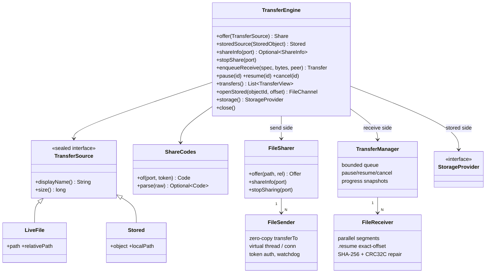
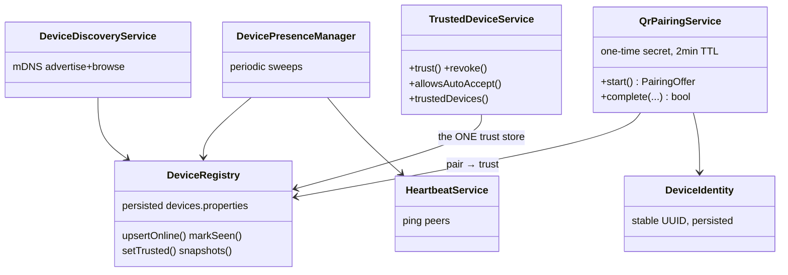
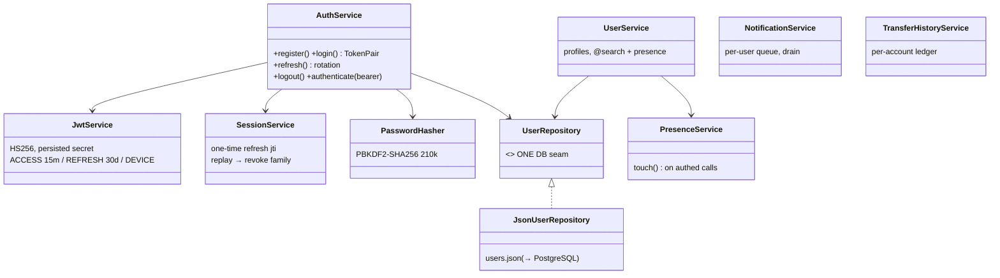
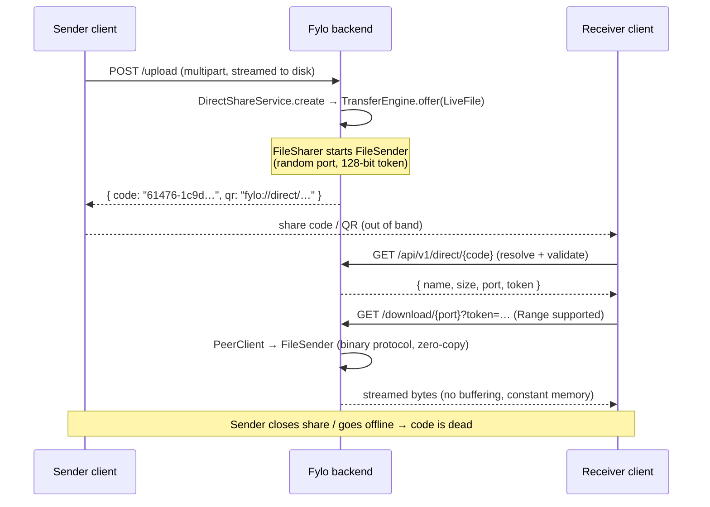
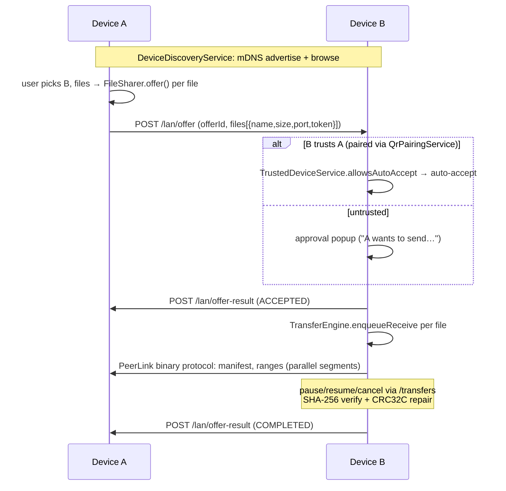
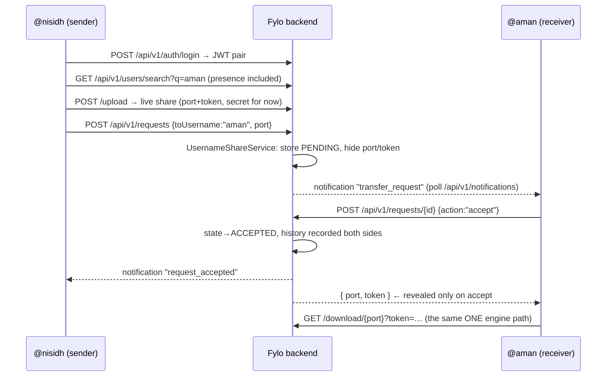

# Air — Unified Platform, Part 1

**One backend · one transfer engine · one API layer · one auth layer · one storage layer · one database seam.**

This document describes the architecture as **implemented in this repository** (every class named here exists and compiles under Java 25). It is the delivery record for Part 1: the PeerLink codebase evolved in place into the unified Fylo platform — no rewrite, no second backend.

Companion documents: [PROTOCOL.md](PROTOCOL.md) (binary wire format), [ARCHITECTURE.md](ARCHITECTURE.md) (transfer-engine performance deep-dive), [LAN-MODE.md](LAN-MODE.md) (nearby mode details), [../FYLO_PROJECT_BACKBONE.md](../FYLO_PROJECT_BACKBONE.md) (long-range product plan).

---

## 1. System architecture overview

```
        Web (Next.js)      Desktop (Win/mac/Linux)      Mobile (Android/iOS)
              │                       │                          │
              └───────────────────────┼──────────────────────────┘
                                      │ HTTPS (one origin, one server)
                                      ▼
   ╔══════════════════════════════════════════════════════════════════════╗
   ║                    FYLO UNIFIED BACKEND (p2p.App)                     ║
   ║                 one JVM · one HttpServer · virtual threads           ║
   ║                                                                      ║
   ║  ┌──────────────────────── ONE API LAYER ───────────────────────┐    ║
   ║  │ FileController (gateway: /upload /download /lan /transfers)  │    ║
   ║  │ ApiRouter      (/api/v1/auth|users|requests|links|devices…,  │    ║
   ║  │                 /s/{slug} public link download)              │    ║
   ║  └──────┬────────────┬─────────────┬─────────────┬──────────────┘    ║
   ║         │            │             │             │                   ║
   ║  ┌──────▼─────┐ ┌────▼──────┐ ┌────▼───────┐ ┌───▼─────────┐         ║
   ║  │  MODE 1    │ │  MODE 2   │ │  MODE 3    │ │  MODE 4     │         ║
   ║  │ Direct     │ │ Nearby    │ │ Username   │ │ Link        │         ║
   ║  │ Share      │ │ Share     │ │ Share      │ │ Share       │         ║
   ║  │ Direct-    │ │ LanShare- │ │ Username-  │ │ LinkShare-  │         ║
   ║  │ Share-     │ │ Service + │ │ Share-     │ │ Service     │         ║
   ║  │ Service    │ │ Offer-    │ │ Service    │ │             │         ║
   ║  │ (guest)    │ │ Manager   │ │ (login)    │ │ (login)     │         ║
   ║  └──────┬─────┘ └────┬──────┘ └────┬───────┘ └───┬─────────┘         ║
   ║         │            │             │             │                   ║
   ║  ┌──────▼────────────▼─────────────▼─────────────▼──────────────┐    ║
   ║  │              ONE TRANSFER ENGINE (p2p.engine)                │    ║
   ║  │  TransferEngine facade                                      │    ║
   ║  │   ├─ send:    FileSharer → FileSender (zero-copy sendfile)  │    ║
   ║  │   ├─ receive: TransferManager → FileReceiver (queue, resume,│    ║
   ║  │   │           pause/cancel, SHA-256 + CRC32C repair)        │    ║
   ║  │   ├─ codes:   ShareCodes (invite code / QR payload)         │    ║
   ║  │   └─ stored:  openStored() (Range streaming from storage)   │    ║
   ║  └───────┬───────────────────────────────────────┬─────────────┘    ║
   ║          │ PeerLink binary protocol              │                  ║
   ║          │ (p2p.protocol)                        │                  ║
   ║  ┌───────▼───────────────┐         ┌─────────────▼─────────────┐    ║
   ║  │  DISCOVERY ENGINE     │         │   ONE STORAGE LAYER       │    ║
   ║  │  DeviceDiscovery(mDNS)│         │   StorageProvider         │    ║
   ║  │  DeviceRegistry       │         │    └─ LocalStorageProvider│    ║
   ║  │  DevicePresenceManager│         │       (MinIO/S3: same     │    ║
   ║  │  HeartbeatService     │         │        interface, Part 2) │    ║
   ║  │  QrPairingService     │         └─────────────┬─────────────┘    ║
   ║  │  TrustedDeviceService │                       │                  ║
   ║  └───────────────────────┘         ┌─────────────▼─────────────┐    ║
   ║  ┌───────────────────────┐         │   ONE DATABASE SEAM       │    ║
   ║  │  ONE AUTH LAYER       │         │   UserRepository (Json →  │    ║
   ║  │  AuthService          │         │   PostgreSQL in Part 2)   │    ║
   ║  │  JwtService (HS256)   │         │   links.json / history →  │    ║
   ║  │  SessionService       │         │   same migration          │    ║
   ║  │  PasswordHasher       │         └───────────────────────────┘    ║
   ║  └───────────────────────┘                                          ║
   ╚══════════════════════════════════════════════════════════════════════╝
```

**The unifying insight:** every mode reduces to *"offer a source, pull it over the one wire protocol."*

| Mode | Login | Source | Discovery | Survives sender leaving |
|------|-------|--------|-----------|------------------------|
| 1 Direct | ❌ | `TransferSource.LiveFile` | Share code / QR (`ShareCodes`) | ❌ (live) |
| 2 Nearby | ❌ | `TransferSource.LiveFile` | mDNS / QR pairing / code | ❌ (live) |
| 3 Username | ✅ | `TransferSource.LiveFile` | `@username` search | ❌ (live) |
| 4 Link | ✅ | `TransferSource.Stored` | URL slug | ✅ (storage layer) |

Modes 1–3 share the identical byte path; mode 4 differs only in that the source was first persisted through `StorageProvider`. There is exactly one implementation of chunking, resume, integrity, progress, and queuing.

---

## 2. Java 25 package structure (as implemented)

```
src/main/java/p2p/
├── App.java                     # entry point — starts the ONE server
│
├── api/                         # ═ ONE API LAYER (new surface) ═
│   └── ApiRouter.java           # /api/v1/** + /s/{slug}; bearer auth; CORS
├── controller/
│   └── FileController.java      # gateway: /upload /download /lan/* /transfers
│                                #  + composition root wiring every service
│
├── engine/                      # ═ ONE TRANSFER ENGINE (facade) ═
│   ├── TransferEngine.java      # the only entry point modes may use
│   ├── TransferSource.java      # sealed: LiveFile | Stored
│   └── ShareCodes.java          # invite-code / QR payload encode+decode
├── transfer/                    # engine internals (pre-existing, unchanged)
│   ├── FileSender.java          # zero-copy send, N clients, virtual threads
│   ├── FileReceiver.java        # parallel segments, resume, verify+repair
│   ├── TransferManager.java     # queue, pause/resume/cancel, progress
│   ├── PeerClient.java          # protocol client (gateway stream-through)
│   ├── ProgressTracker.java     # speed / ETA snapshots
│   ├── ResumeState.java         # .resume metadata (exact-byte resume)
│   └── TransferConfig.java      # LAN/WAN/high-latency tuning presets
├── protocol/                    # binary wire protocol (pre-existing)
│   ├── PeerLinkProtocol.java    # frames, message types, limits
│   ├── TransferManifest.java    # name, size, SHA-256, chunk size, id
│   └── TransferException.java
│
├── auth/                        # ═ ONE AUTH LAYER ═
│   ├── AuthService.java         # register/login/refresh-rotation/logout
│   ├── JwtService.java          # HS256 issue+verify: ACCESS|REFRESH|DEVICE
│   ├── SessionService.java      # one-time refresh jti registry (rotation)
│   ├── PasswordHasher.java      # PBKDF2-HMAC-SHA256, 210k iterations
│   └── AuthContext.java         # authenticated principal
├── user/                        # ═ USER SYSTEM ═
│   ├── User.java                # account record + safe Profile projection
│   ├── UserRepository.java      # ═ ONE DATABASE SEAM ═ (port interface)
│   ├── JsonUserRepository.java  # Part-1 impl; PostgreSQL swaps in behind it
│   ├── UserService.java         # profiles + @username search (w/ presence)
│   ├── PresenceService.java     # online users (TTL on authed requests)
│   ├── NotificationService.java # per-user queue (poll now, WS push later)
│   └── TransferHistoryService.java # durable per-account ledger
│
├── share/                       # ═ MODE SERVICES (thin; all call the engine) ═
│   ├── DirectShareService.java  # mode 1: offer → code/QR
│   ├── UsernameShareService.java# mode 3: request→accept/reject handshake
│   ├── TransferRequest.java     # mode 3 state machine record
│   ├── LinkShareService.java    # mode 4: storage upload, slugs, expiry sweep
│   └── ShareLink.java           # mode 4 record (2-day default expiry)
├── lan/                         # mode 2 service (pre-existing = nearby mode)
│   ├── LanShareService.java     # sender side: offers to discovered devices
│   ├── OfferManager.java        # receiver side: approval, trust auto-accept
│   ├── ControlPlaneClient.java  # device↔device JSON control plane
│   ├── LanMessages.java / IncomingOffer.java
│
├── device/                      # ═ DISCOVERY ENGINE ═
│   ├── DeviceDiscoveryService.java # mDNS/DNS-SD advertise + browse
│   ├── DeviceRegistry.java      # known devices + trust flags (persisted)
│   ├── DevicePresenceManager.java  # online/offline sweeps
│   ├── HeartbeatService.java    # liveness pings
│   ├── DeviceIdentity.java      # stable device id (persisted)
│   ├── DeviceInfo.java          # snapshot record
│   ├── QrPairingService.java    # NEW: one-time QR/code pairing → trust
│   └── TrustedDeviceService.java# NEW: trust policy front (auto-accept etc.)
│
├── storage/                     # ═ ONE STORAGE LAYER ═
│   ├── StorageProvider.java     # port: put/stat/open/openChannel/delete
│   ├── LocalStorageProvider.java# Part-1 impl (SHA-256 on write, sidecar meta)
│   └── StoredObject.java        # object metadata record
│
├── security/
│   └── TransferTokens.java      # 128-bit per-transfer bearer tokens
├── service/
│   └── FileSharer.java          # active-share registry (one FileSender each)
├── util/ Hashing.java           # streaming SHA-256 (fixed buffer)
└── utils/ MultipartUploads.java # THE multipart streamer (shared by both
                                 #   upload endpoints) + UploadUtils.java
```

---

## 3. Class diagrams

### 3.1 Transfer engine



### 3.2 Discovery & devices



### 3.3 Auth & user system



---

## 4. Sequence diagrams — the four modes

### Mode 1 — Direct Share (guest, live)



### Mode 2 — Nearby Share (guest, LAN)



### Mode 3 — Username Share (login, live)



### Mode 4 — Link Share (login, cloud)

```mermaid
sequenceDiagram
    participant A as Owner
    participant S as Fylo backend
    participant X as Anyone with the link

    A->>S: POST /api/v1/links/upload (multipart, Bearer JWT)
    S->>S: StorageProvider.put (stream + SHA-256 in one pass)
    S->>S: LinkShareService: slug, expiresAt = now + 2 days (default)
    S-->>A: { url:"/s/ggn7IkEQ", expiresAt, downloads:0 }
    A-->>X: https://fylo.app/s/ggn7IkEQ
    X->>S: GET /s/ggn7IkEQ  (optionally Range: bytes=…)
    S->>S: TransferEngine.openStored → FileChannel.transferTo(socket)
    S-->>X: 200/206 streamed zero-copy; downloadCount++
    Note over S: sender offline? irrelevant — bytes are in storage.<br/>Sweeper (virtual thread) deletes expired links + objects.
```

---

## 5. Why this satisfies the core principle

| Principle | Enforcement in code |
|-----------|--------------------|
| ONE backend | `p2p.App` starts a single `HttpServer`; `ApiRouter.mount()` adds the unified routes to the *same* server the gateway uses. |
| ONE transfer engine | `TransferEngine` is the only public entry; mode services hold no references to `FileSender`/`FileReceiver`. Modes 1–3 literally share `FileSharer.offer()`; mode 4 reads through `engine.openStored()`. |
| ONE API layer | `FileController` (transfer gateway) + `ApiRouter` (platform API) on one port, one CORS policy, one auth helper. |
| ONE auth layer | Guest modes need nothing; both account modes authenticate through `AuthService.authenticate()` and the single `JwtService` secret. |
| ONE storage layer | Only `StorageProvider` touches durable bytes; only Link Share uses it. |
| ONE database | All account state flows through `UserRepository` (+ sibling JSON stores), the explicit PostgreSQL seam. |
| No duplicate implementations | Multipart streaming extracted to `MultipartUploads` and shared by both upload endpoints; trust lives only in `DeviceRegistry`; token compare only in `TransferTokens`. |

**Performance posture (unchanged from the proven engine):** no file bytes on the heap — sends are `FileChannel.transferTo` (kernel `sendfile`), receives use fixed direct buffers, uploads stream through 64 KB buffers, storage writes hash-while-copying in one pass. One virtual thread per connection/transfer (Java 25), so 40 GB — or 100 GB — transfers hold well under 100 MB RSS regardless of concurrency. Resume is exact-byte via `.resume` metadata; integrity is whole-file SHA-256 with per-chunk CRC32C re-fetch instead of restart.

---

## 6. Migration plan (existing code → unified platform)

### Phase 0 — done before Part 1
Working transfer engine, binary protocol, mDNS discovery, LAN offers/trust, queue with pause/resume, Java 25 toolchain.

### Phase 1 — this delivery (all merged, tests green)
1. **Engine facade** — `p2p.engine.TransferEngine` + sealed `TransferSource` + `ShareCodes`; `FileController` composition switched to it. Existing `transfer/*` classes untouched (they are the engine internals).
2. **Storage seam** — `StorageProvider` + `LocalStorageProvider` (streams, hashes, sidecar metadata).
3. **Auth layer** — `JwtService` (HS256, persisted secret), `PasswordHasher` (PBKDF2), `SessionService` (rotation + replay revocation), `AuthService`.
4. **User system** — `User(Repository)`, `UserService`, `PresenceService`, `NotificationService`, `TransferHistoryService`.
5. **Mode services** — `DirectShareService` (codes/QR added to the existing upload response — backward compatible), mode 2 = existing `lan` package, `UsernameShareService`, `LinkShareService` (2-day default expiry, sweeper).
6. **Discovery extensions** — `QrPairingService` (one-time secrets → mutual trust), `TrustedDeviceService` (trust policy front).
7. **Unified API** — `ApiRouter` mounted on the same server; legacy routes unchanged so the current UI keeps working.
8. **Dedup** — multipart streaming unified in `MultipartUploads`.

### Phase 2 — hardening ✅ DELIVERED
- ✅ `UserRepository` → PostgreSQL (`PgUserRepository`); transfer sessions/requests/history → `Pg*Repository` over V1-V3 migrations (JSON-file fallbacks without `DATABASE_URL`).
- ✅ `StorageProvider` → MinIO/S3 (`S3CompatibleStorageProvider`, multipart PUT ≥ 64 MB, ranged GET).
- ✅ WebSocket push (`p2p.ws.WebSocketServer` RFC 6455 on port+1, `WebSocketNotifier` facade) fed by `NotificationService`, `UsernameShareService`, and `TransferManager` progress/status events; Redis pub/sub fan-out across instances.
- ✅ Redis integration (`p2p.infra.RedisClient`): shared rate-limit counters, single-use refresh sessions + rotation blacklist, cross-instance presence — all with in-memory fallbacks.
- ✅ `/health` + `/actuator/health` (component checks: database/redis/storage), Prometheus metrics expanded (transfer bytes/errors/duration histogram, WS connections, storage used), alert rules + Grafana dashboard in `deploy/`.
- ✅ Kubernetes manifests (`k8s/`: HPA, probes, StatefulSets, ingress with TLS + WS routing), Testcontainers integration tests (Postgres + MinIO), Gatling load simulations (`src/test/scala/p2p/load`).
- Remaining for Part 3: server-relayed rendezvous for Direct Share across NATs; presigned-GET offload for `/s/{slug}`.

### Phase 3 — ecosystem (later)
Clipboard/notification/photo/folder sync and cross-device file access all ride the existing rails: trusted-device gating via `TrustedDeviceService`, transport via `TransferEngine`, addressing via `DeviceRegistry`. Optional package rename `p2p` → `com.fylo` as a single mechanical refactor once Part 2 lands.

### Compatibility guarantees during migration
- `/upload` response is a strict superset (added `code`, `qr`).
- `/download`, `/lan/*`, `/transfers` byte-for-byte unchanged.
- All new surface lives under `/api/v1/**` and `/s/**`.

---

## 7. Verification record (2026-07-05)

- `mvn test` — full suite green (transfer + LAN integration tests boot the real server with the new wiring).
- Live smoke test against the packaged jar: register → login → search; refresh rotation (replayed token correctly rejected); guest direct-share upload → code lookup → byte-identical download; username request → notification → accept reveals port/token → history recorded; link upload → public `/s/{slug}` download (byte-identical) → Range request resumes mid-file → download counter increments; QR pairing offer minted with 2-minute expiry.
